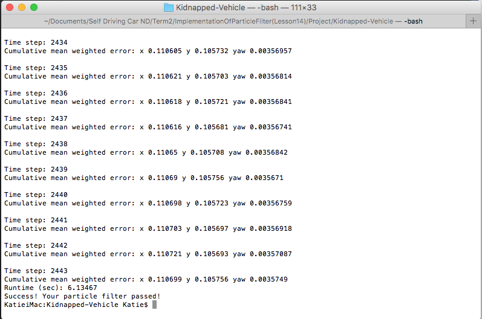
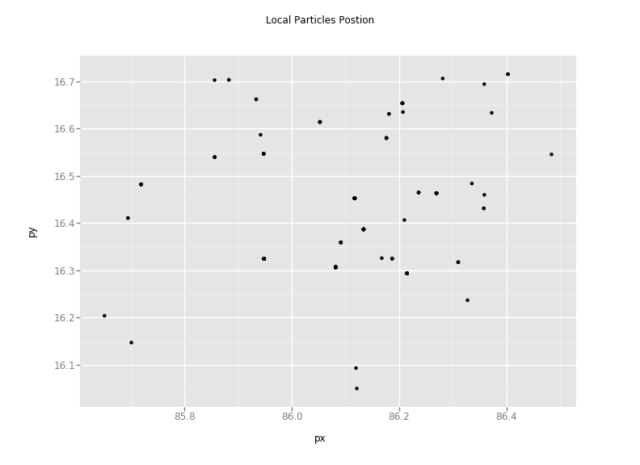

# Introduction
This project implements a particle filter in C++ to localize the kidnapped vehicle. Particle Filter belongs to the category of Bayes Filters (EKF, UKF and Markov Localization are other examples). Bayes Filter is a framework for recursive state estimation which has two primary steps.
1. Prediction Step (using Motion Model)
2. Update Step (using Observation Model)  

## Overview of Particle Filter
Particle Filters are better than Kalman Filters in multimodal dimensional space because a particle filter represents uncertainty using particles. Each of these particles have the same properties (like x, y and angle for localization) and each of them represent a guess. Several thousands of these guesses represents the posterior of the object. The particle filter makes a particle survive in proportion to how each particle is with the sensor measurement (i.e. this is done by assigning weights).

The essence of the particle filters is have the particles guess where the object might be moving. Locations with a higher probability will collect more particles and hence represent the object's posterior belief. The cloud of particles represents the object's posterior belief as the object localizes itself.

Here are a couple of images of localization using Particle Filters from Sebastian's paper (http://robots.stanford.edu/papers/thrun.pf-in-robotics-uai02.pdf).

<p align="center">
   
</p>
<p align="center">
   <i>Figure 1: Initial State</i>
</p>  

<p align="center">
   
</p>
<p align="center">
   <i>Figure 2: State after a few Iterations</i>
</p>  

## Project Introduction
The idea behind this project is to locate a kidnapped vehicle. The vehicle has a map of this location, a (noise) GPS estimate of the initial location and a lot of (noisy) sensor and control data.

This project implements a 2 dimensional particle filter. At each time step the filter will also get observation and control data.

### Implementing the Particle Filter
The directory structure of this repository is as follows:

```
root
|   build.sh
|   clean.sh
|   CMakeLists.txt
|   README.md
|   run.sh
|
|___data
|   |   control_data.txt
|   |   gt_data.txt
|   |   map_data.txt
|   |
|   |___observation
|       |   observations_000001.txt
|       |   ...
|       |   observations_002444.txt
|   
|___src
    |   helper_functions.h
    |   main.cpp
    |   map.h
    |   particle_filter.cpp
    |   particle_filter.h
```

The brains behind the logic is in the file `particle_filter.cpp` under the `src` directory. The file contains the scaffolding of a `ParticleFilter` class and some associated methods. Read through the code, the comments, and the header file `particle_filter.h` to get a sense for what this code does.

`src/main.cpp` contains the code that will actually be running your particle filter and calling the associated methods.

### Inputs to the Particle Filter
You can find the inputs to the particle filter in the `data` directory.

#### The Map
`map_data.txt` includes the position of landmarks (in meters) on an arbitrary Cartesian coordinate system. Each row has three columns
1. x position
2. y position
3. landmark id

> Map data provided by 3D Mapping Solutions GmbH.

#### Control Data
`control_data.txt` contains rows of control data. Each row corresponds to the control data for the corresponding time step. The two columns represent
1. vehicle speed (in meters per second)
2. vehicle yaw rate (in radians per second)

#### Observation Data
The `observation` directory includes around 2000 files. Each file is numbered according to the timestep in which that observation takes place.

These files contain observation data for all "observable" landmarks. Here observable means the landmark is sufficiently close to the vehicle. Each row in these files corresponds to a single landmark. The two columns represent:
1. x distance to the landmark in meters (right is positive) RELATIVE TO THE VEHICLE.
2. y distance to the landmark in meters (forward is positive) RELATIVE TO THE VEHICLE.

> **NOTE:**
> The vehicle's coordinate system is NOT the map coordinate system. The code handles transforming it into map coordinate system.

### Running the Code
From the root directory run the following commands from the command line:

```
> ./clean.sh
> ./build.sh
> ./run.sh
```

> **NOTE:**
> If you get any `command not found` problems, you will have to install
> the associated dependencies (for example,
> [cmake](https://cmake.org/install/))

The confirmation that the filter is working is by looking at the output on the terminal, which looks something like this:

<p align="center">
   
</p>
<p align="center">
   <i>Figure 3: Terminal Output</i>
</p>  

### Particles Visualization
Initially the particles are distributed based on the first captured GPS position. The image below shows how the particles are distributed across the first GPS space (+/- 0.3m of GPS (x,y) location).

<p align="center">
   
</p>
<p align="center">
   <i>Figure 4: Particles</i>
</p>

But after a few iterations, the particles are selected based on weights, position and orientation which are in compliance with the vehicle position and orientation.

<p align="center">
   
</p>
<p align="center">
   <i>Figure 5: Particles after 10 time steps</i>
</p>

<p align="center">
   
</p>
<p align="center">
   <i>Figure 6: Particles after 1000 time steps</i>
</p>

<p align="center">
   
</p>
<p align="center">
   <i>Figure 7: Final Particles position</i>
</p>

Here is a GIF which shows the particles which are collected and which represent the state of the kidnapped vehicle i.e. the position within the space defined.

<p align="center">
   
</p>
<p align="center">
   <i>Figure 8: Particles tracking kidnapped vehicle</i>
</p>

### Success Criteria
1. **Accuracy:** The particle filter should localize vehicle position and yaw to within the values specified in the parameters `max_translation_error` (maximum allowed error in x or y) and `max_yaw_error` in `src/main.cpp`.

2. **Performance:** The particle filter should complete execution within the time specified by `max_runtime` in `src/main.cpp`.
